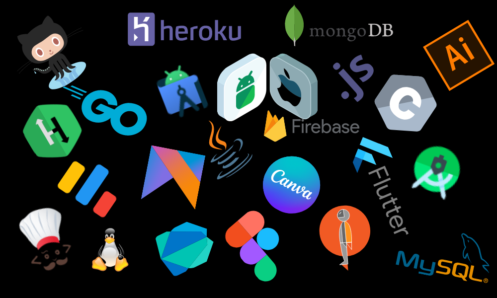

<!-- Matrix Gif Here -->

[](https://www.youtube.com/watch?v=SDkAGkd4NLc)

<!-- Greet Line Comes Here -->
<p align="center">
<a href="#"></a>
</p>

<!-- Coloured Line -->
<h3 align="center">

</h3>

<!-- Introduction Section Here -->
<h1 align="center">Hello  , I'm Keshav Sariya</h1>
<h3 align="center">A passionate Full Stack Developer and Blockchain enthusiast
  from India </h3>

<p align="center">
  <a href="https://github.com/kogutstt2"></a>
</p>

<!-- Coloured Lines -->
<h3 align="center">

</h3>

<!-- Animated Gif Here -->
<p align="center">
  
</p>

<!-- Coloured Line -->
<h3 align="center">

</h3>

<!-- About Me Section Here -->

## <picture></picture> *About Me*


- 😄 Pronouns: **He/His**

- 🌱 I’m currently working on **Supply Chain Management System**

- 🏆 I am learning the language ** Solidity**

- 💬 Ask me about **about Web Development**

- 📫 How to reach me keshavsariya@gmail.com

- ⚡ freeCodeCamp.org has been a major source of inspiration in my life.❤‍🔥**

<!-- Coloured Line -->
<h3 align="center">

</h3>

### A Little More About Me! 🧟‍♂️

```javascript
const Keshav = { 
  askMeAbout: ["Web Dev", "Tech", "Editing"],
  
  frontEnd: ["HTML5", "CSS3", "React"], 
  
  backEnd: ["NodeJS", "Express"],
  
  programmingLanguages: ["C", "C++", "Python", "JavaScript"],
  
  databases: ["MongoDB", "MySQL", "PostgreSQL"],
  
  devOps: ["AWS", "Docker"],
  
  others: ["Linux"], 
  
  blockchain: ["Solidity", "Rust"], 
  
  tools: ["Photoshop"], 
  
  techCommunities: [
    "Google Crowdsource",
    "Github Developers Club",
    "Follow Me on LinkedIn", 
    "StackOverflow",
  ],

  hobbies: [
    "Playing Games",
    "Tech Enthusiast",
    "Being up all Night Chasing that ONE BUG..."
  ],

  challenge: ["I am Learning Managing Blockchain Technology"], 
  
  lastButNotLeast: ["Updating Myself Virtually and in Reality"]
};
```


<!-- Coloured Line -->
<h3 align="center">

</h3>

<!-- Connect With Me Section Here -->
<h1 align="left">🤞 Connect with Me</h1>
<p align="left">
<a href="https://www.instagram.com/_.keshaav_/" target="blank"></a>
<a href="https://www.linkedin.com/in/keshav-sariya-0777a0339/" target="blank"></a>
<a href="https://leetcode.com/u/keshavsariya/" target="blank"></a>


<!-- Language and Tools Section Here -->
<h1 align="left">🛠 Language and Tools</h1>

<!-- Vector Tool Gif -->
<p align='center'>
</img></p>
<!-- Vector Tool Gif Ends -->

<p align="left"> 
  <a href="https://en.wikipedia.org/wiki/C_(programming_language)" target="_blank" rel="noreferrer"> 
     
  </a> 
  <a href="https://en.wikipedia.org/wiki/C%2B%2B" target="_blank" rel="noreferrer"> 
     
  </a> 
  <a href="https://developer.mozilla.org/en-US/docs/Web/JavaScript" target="_blank" rel="noreferrer"> 
     
  </a> 
  <a href="https://www.python.org" target="_blank" rel="noreferrer"> 
     
  </a> 
  <a href="https://reactjs.org/" target="_blank" rel="noreferrer"> 
     
  </a> 
  <a href="https://www.w3schools.com/css/" target="_blank" rel="noreferrer"> 
     
  </a> 
  <a href="https://www.w3.org/html/" target="_blank" rel="noreferrer"> 
     
  </a> 
  <a href="https://nodejs.org" target="_blank" rel="noreferrer"> 
     
  </a> 
  <a href="https://expressjs.com" target="_blank" rel="noreferrer"> 
     
  </a> 
  <a href="https://reactnative.dev/" target="_blank" rel="noreferrer"> 
     
  </a> 
  <a href="https://www.mongodb.com/" target="_blank" rel="noreferrer"> 
     
  </a> 
  <a href="https://www.mysql.com/" target="_blank" rel="noreferrer"> 
     
  </a> 
  <a href="https://www.postgresql.org" target="_blank" rel="noreferrer"> 
     
  </a> 
  <a href="https://aws.amazon.com" target="_blank" rel="noreferrer"> 
     
  </a> 
  <a href="https://www.docker.com/" target="_blank" rel="noreferrer"> 
     
  </a> 
  <a href="https://www.adobe.com/products/photoshop.html" target="_blank" rel="noreferrer"> 
     
  </a> 
  <a href="https://www.linux.org/" target="_blank" rel="noreferrer"> 
     
  </a> 
  <a href="https://soliditylang.org/" target="_blank" rel="noreferrer"> 
     
  </a> 
</p>


<!-- Coloured Line -->
<h3 align="center">

</h3>

<!-- Tech Stack Section Here -->

# 💻 Tech Stack:


<h3 align="center">

</h3>

<!-- SkillSet Section Here -->

# 👨‍💻 My Skills Set:

<table><tr><td valign="top" width="33%">

## Frontend

  <div align="center">
  <a href="https://reactjs.org/" target="_blank"></a>
  <a href="https://www.w3schools.com/css/" target="_blank"></a>
  <a href="https://en.wikipedia.org/wiki/HTML5" target="_blank"></a>
  <a href="https://www.javascript.com/" target="_blank"></a>
  <a href="https://nodejs.org/" target="_blank"></a>
  <a href="https://expressjs.com/" target="_blank"></a>
  <a href="https://www.adobe.com/in/products/photoshop.html" target="_blank"></a>
  <a href="https://wordpress.com/" target="_blank"></a>
  <a href="https://mui.com/" target="_blank"></a>
  <a href="https://www.python.org/" target="_blank"></a>
</div>


</td><td valign="top" width="33%">

## Backend

<div align="center">  
<a href="https://www.javascript.com/" target="_blank"></a>  
<a href="https://www.mongodb.com/" target="_blank"></a>  
<a href="https://nodejs.org/" target="_blank"></a>  
<a href="https://www.linux.org/" target="_blank"></a>  
<a href="https://www.python.org/" target="_blank"></a>  
<a href="https://expressjs.com/" target="_blank"></a>  
<a href="https://redux.js.org/" target="_blank"></a>  
<a href="https://www.mysql.com/" target="_blank"></a>  
<a href="https://www.postgresql.org/" target="_blank"></a>  

</td><td valign="top" width="33%">

## DevOps

<div align="center">  
<a href="https://aws.amazon.com/" target="_blank"></a>     
<a href="https://www.linux.org/" target="_blank"></a>  
<a href="https://github.com/" target="_blank"></a>  
<a href="https://www.mysql.com/" target="_blank"></a>    
<a href="https://www.postgresql.org/" target="_blank"></a>  
<a href="https://docs.microsoft.com/en-us/powershell/" target="_blank"></a>   
<a href="https://firebase.google.com/" target="_blank"></a>   
<a href="https://www.docker.com/" target="_blank"></a>  
<a href="https://redis.io/" target="_blank"></a>  
</div>

</td></tr></table>

<h3 align="center">

</h3>

<!-- GitHub Stats Section Here -->

# 📊 GitHub Stats

<hr>

|               |                                |
| -------------------------------------------------------------------------------------------------------------------------------------- | ------------------------------------------------------------------------------------------------------------------------------------------- |
|  |  |

<!-- color=nord_dark -->

<hr>

<p align="center">

</p>

<!-- Coloured Line -->
<h3 align="center">

</h3>

<!-- GitHub Contribution Section Here -->

## 📈 GitHub Contribution Graph

[](https://github.com/keshav1404-web/github-readme-activity-graph)

<hr>

<!-- Coloured Line -->
<h3 align="center">

</h3>


<h3 align="center">

</h3>

<div align="center">

</div>

<h3 align="center">

</h3>


###

<h3 align="center">

</h3>


<div align="center">

### Made By ❤️ KESHAV SARIYA

</div>
<!--
**keshav1404-web/keshav1404-web** is a ✨ _special_ ✨ repository because its `README.md` (this file) appears on your GitHub profile.

Here are some ideas to get you started:

- 🔭 I’m currently working on ...
- 🌱 I’m currently learning ...
- 👯 I’m looking to collaborate on ...
- 🤔 I’m looking for help with ...
- 💬 Ask me about ...
- 📫 How to reach me: ...
- 😄 Pronouns: ...
- ⚡ Fun fact: ...
-->
